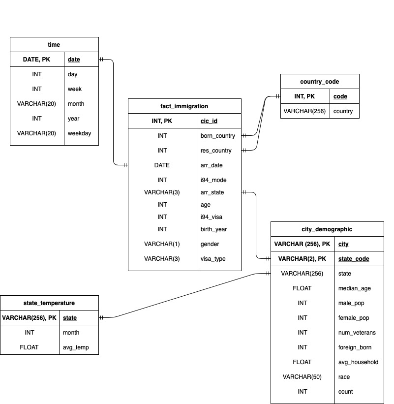
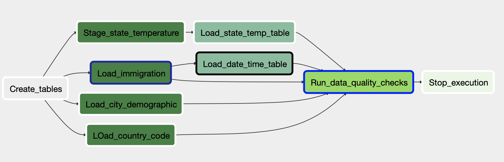

# Project: Data Engineering Capstone Project

## Purpose
The purpose of this project is to build a high grade ETL pipeline that will help United States Immigration Department with at least 100+ users to get insight of people traveling to United States. As more and more people travel to United States for different purposes daily, it's expected that the data will explode more than 100x to the current sample data that we have. As a result of these requirements, this new pipeline is expected to be more dynamic and built from reusable tasks, can be monitored, allow easy backfills, and can be automated to run daily at 7 am.

These are some of use cases that the users would like to be able to analyze through this new pipeline:
- Which states and when do people travel more to? 
- What's the correlation between this travel pattern and the city demographic in some states?
- What's the correlation between this travel pattern and state temperatures?

## Data Sources
The new pipeline will use data from the following resources and transform them as fact and dimension tables.
- I-94 Immigration Data from the US National Tourism and Trade Office [here](https://travel.trade.gov/research/reports/i94/historical/2016.html)
- World Temperature Data from Kaggle [here](https://www.kaggle.com/berkeleyearth/climate-change-earth-surface-temperature-data)
- U.S. City Demographic Data from OpenSoft [here](https://public.opendatasoft.com/explore/dataset/us-cities-demographics/export/)

The immigration data will be in SAS format and the other datas are mostly in CSV format. 

## Database Schema and DAG
To optimize the query on immigration data analysis, we will use Star Schema for ETL (Extract, Transform, & Load) the data to fact and dimension tables.
Below is how the fact and dimension tables will look like:

Due to the nature size and accessibility of these data, we will use the following tools and infrastructure 
- Amazon Redshift: Analytical database that is optimized for aggregation, read-heavy workloads, and auto scaling
- Cassandra: It is optimized for reading and writing for large amount of data. It aggregates the data into analytic tables in Redshift
- Apache Airflow: Data pipeline that can be automated to run at certain time without any human inteference

Then the data will go through ETL process using Amazon Redshift and stored [here](s3a://udacitycapstoneproj/data/). The following graph view of Apache Airflow DAG:  
    

## Instructions
To get started with the project:
1. The project package contains 5 major components: 

    - The python & config files that help with extracting data and load the data to Amazon S3
    - The data folder has city demographic data, state temperature data, and 
    - The dag template has all the imports and task templates in place, but the task dependencies have not been set
    - The operators folder with operator templates
    - A helper class for the SQL transformations

2. DAG configuration  
    Currently DAG is set to these guidelines: 

    - The DAG does not have dependencies on past runs
    - On failure, the task are retried 3 times
    - Retries happen every 5 minutes
    - Catchup is turned off
    - Do not email on retry
    
3. As part of this project, we create 4 new operators: 

   - Stage Operator (StageToRedshiftOperator) 
     This stage operator is expected to be able to load any JSON formatted files from S3 to Amazon Redshift. The operator creates and runs a SQL COPY statement based on the parameters provided. The operator's parameters should specify where in S3 the file is loaded and what is the target table.
   - Fact and Dimension Operators (LoadFactOperator & LoadDimensionOperator) 
     With dimension and fact operators, we can utilize the provided SQL helper class to run data transformations. Most of the logic is within the SQL transfoßrmations and the operator is expected to take as input a SQL statement and target database on which to run the query against.
   - Data Quality Operator (DataQualityOperator) 
     This data quality operator is used to run checks on the data itself. Currently, it only checks if any table contains empty record. If there's, it will throw an error

4. Before running the program, first edit the config file called 'config.cfg' to configure AWS Key ID & Access Key. After that, run the following command to extract all the data from local storage and store them as Parquet files in Amazon S3  
    `python3 etl.py`
    
5. Once all the data are successfully extracted, add the following Airflow connections through Airflow UI: 
    - aws_credentials : Set the connection type as "Amazon Web Services" and enter your aws login & password
    - redshift        : Set the connection type as "Postgres" and enter all your redshift cluster information like host, schema, login, password, and port number

## Author
Budi Sulayman

## License
This project is licensed under [MIT](https://choosealicense.com/licenses/mit/)